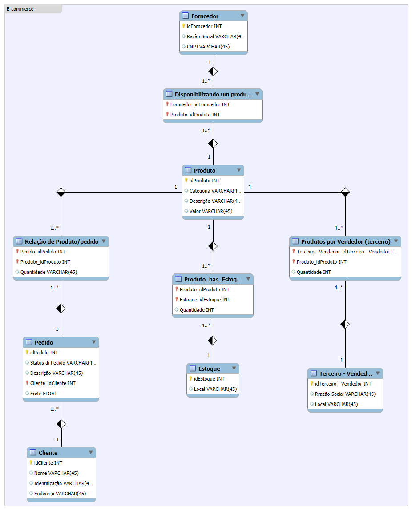

# Desafio 01: Refinando a Modelagem do Cenário E-commerce

## Descrição do Desafio

Neste desafio, o objetivo é **refinar a modelagem** do cenário de e-commerce, considerando as seguintes **entidades e suas relações:**

* **Cliente:**
  * **PJ** (Pessoa Jurídica)
  * **PF** (Pessoa Física)
  * **Pagamentos:** Um cliente pode ter múltiplas formas de pagamento cadastradas.
  * **Entregas:** Possui status e código de rastreio.

## Diagrama de Entidade-Relacionamento Estendido (EER)

Diagrama apresentado pela **@julianazanelatto** na aula e construído por André Freitas na ferramenta MySQL WorkBench

**A modelagem pode ser realizada em diversos aplicações, exemplo:** 

* **MySQL WorkBench** Ferramenta utilizada pela Juliana durante as aulas
* **Draw.io:**
* **dbdesigner.net**

## Considerações e Decisões de Modelagem

* **Herança:** Uma possível abordagem é utilizar herança para representar os tipos de clientes (PJ e PF).
* **Tabelas:** As entidades Pagamento e Entrega podem ser tabelas relacionadas à entidade Cliente através de uma chave estrangeira.
* **Normalização:** Certifique-se de que o modelo esteja normalizado para evitar redundâncias e inconsistências.

## Contribuições

Sinta-se à vontade para contribuir com este projeto! 
* **Fork:** Crie uma cópia do repositório.
* **Clone:** Faça o download da sua cópia.
* **Crie um branch:** Inicie uma nova linha de desenvolvimento.
* **Faça suas alterações:** Edite os arquivos.
* **Commit:** Salve suas alterações.
* **Push:** Envie suas alterações para o seu repositório.
* **Pull request:** Envie uma solicitação de mesclagem.

**Utilize este README como um guia para desafio 01 do bootcamp e facilitar a colaboração com outros estudantes.**

Agradecimentos especiail a:

* **@julianazanelatto** (perfil: https://github.com/julianazanelatto) pelas aulas do bootcamp e propostas de desafio
